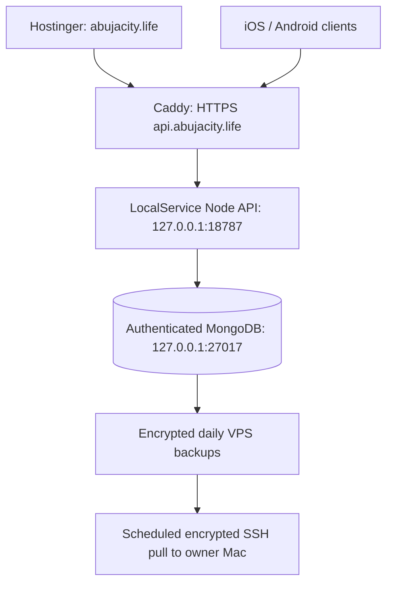

# AbujaLife production operations

The production domain is **https://abujacity.life**, confirmed in the owner’s Hostinger account. Hostinger serves the static game and `/admin/`. The Windows VPS **173.212.249.202** runs the isolated API and private database. These instructions replace the earlier cloud handoff’s Linux/Docker assumptions. See PRODUCTION_ACCEPTANCE.md for observed live results and outstanding gates.



## Isolation and existing infrastructure

Okrika’s Hostinger backend uses its existing authenticated `okrika` MongoDB replica set on VPS port **27018**, restricted by its existing firewall rule to Hostinger’s backend address. Okrika White Studio runs at `127.0.0.1:8091` behind `white-ai.okrika.store`. Its Windows tasks are `Okrika-Caddy` and `Okrika-White-AI`. AbujaLife does not modify their data, secrets, service, ports, tasks or firewall rules. Never stop/rebind/block 27018 as part of AbujaLife operations.

The existing proxy is `C:\Caddy\caddy.exe`, configuration `C:\Caddy\Caddyfile`, running as SYSTEM through `Okrika-Caddy`. AbujaLife adds one API hostname after validating the full configuration. The original file is retained as `Caddyfile.before-abujalife-TIMESTAMP`. The proxy is reloaded in place.

AbujaLife resources:

| Resource | Actual configuration |
| --- | --- |
| Root | `C:\services\abujalife` |
| Immutable releases | `releases\REVISION-DIGEST` under that root |
| Runtime configuration | `shared\windows.json` |
| Runtime provider configuration | `shared\providers.json`, optional and private |
| Secrets | `shared\.secrets`, generated only on server |
| Active / previous release | `shared\state\current.json`, `previous.json` |
| Supervisor control/status | `shared\run\api-control.json`, `supervisor-state.json` |
| API task | `AbujaLife-API`, LocalService, startup recovery and supervised child restart |
| Mongo service | `AbujaLifeMongoDB`, automatic startup and service recovery |
| Backup task | `AbujaLife-Backup`, SYSTEM, daily 03:15 server local time |
| Backup lock recovery | `AbujaLife-Mongo-LockGuard`, every five minutes |
| API ports | loopback 18787; loopback candidate 18788 during deployment |
| Mongo port / database / replica set | loopback 27017 / `abujalife_prod` / `abujalife` |
| Public AbujaLife surface | VPS 80 redirects to HTTPS 443; existing SSH 22 for administration |
| Redis | Not used; authenticated SSE realtime in one API process |

The VPS has other pre-existing management/application services. AbujaLife’s firewall change blocks only its private ports 27017, 18787 and 18788. Do not disable Windows Firewall or modify another project’s access to reduce the apparent port list.

## Build, release and deployment

Development remains `git pull`, `npm ci`, `npm run dev`, using Node 24 or newer. Production code is promoted to `main` only after QA and CI. The static build obtains exactly two public variables: `PUBLIC_WEB_URL` and `API_PUBLIC_URL`. It includes no server code, database URI, payment secrets or private environment files.

On the Mac, from a clean validated checkout:

```bash
npm ci --ignore-scripts
npm run qa
npm run build
node deploy/package-release.mjs /PRIVATE_OUTPUT/abujalife-production-api.tar.gz
python3 deploy/package-frontend.py /PRIVATE_OUTPUT/abujacity-production-frontend.zip
```

The source archive includes QA fixtures and source scripts so the Windows release can run deterministic installation, application QA and production build. Local preview code is private QA input; the genuine production frontend is always `dist/`. Archives contain SHA-256 manifests and the committed revision. Private files, databases, backups, secrets, dependencies and Git history are excluded. `deploy/verify-release.mjs` validates every packaged file. Dirty releases are refused for production promotion.

Copy a verified source archive using the authorized Mac SSH key, unpack it into an isolated staging directory under the AbujaLife root, then run from an Administrator PowerShell session:

```powershell
$env:ABUJALIFE_WINDOWS_ROOT = 'C:\services\abujalife'
.\deploy\windows\deploy.ps1 -SourceDirectory 'C:\services\abujalife\staging\RELEASE'
```

The first deployment also runs `deploy\windows\initialize.ps1` with explicit Node/mongod/database-tools paths and the actual HTTPS origins. This generates separate Mongo root/application/backup passwords, replica-set keyfile, stable payment configuration encryption key and backup encryption key without printing them. It installs only the dedicated Mongo service and AbujaLife tasks. Do not regenerate or lose stable keys on updates.

Deployment verifies source hashes, installs with `npm ci`, runs `npm run qa` and `npm run build`, obtains a validated pre-update backup, applies schema/index changes, and starts a candidate on private 18788. Only after readiness does it switch the protected release pointer and gracefully reload the API. Failed validation preserves the running API. Failed activation restores the prior software pointer; it does not discard player data or reverse database changes. Releases must remain compatible with their preceding database schema.

GitHub CI runs Linux QA/build/isolated Docker Mongo infrastructure checks and Windows QA/build/PowerShell parsing. The Docker stack remains a tested alternative; it is not the actual Windows VPS runtime.

After CI succeeds on `main`, `.github/workflows/frontend-deploy.yml` builds the
connected game, adds the release manifest and force-updates the generated
`hostinger-production` artifact branch. Hostinger's Git auto-deployment watches
that branch and publishes it to the AbujaLife-specific `public_html`. The VPS
task `AbujaLife-AutoDeploy` checks the public GitHub check-runs API every five
minutes, waits for both AbujaLife CI and frontend deployment to be successful,
then clones that exact `main` revision and invokes the same candidate-based
`deploy.ps1` promotion. A failed build, check or health test leaves the current
release running. This is the normal production path; the ZIP commands above
remain private release/debug tooling and recovery fallback only.

## Configuration, authentication and data

`shared\windows.json` stores public origins, ports, runtime paths and retention settings. `shared\.secrets` stores private values. The API receives only necessary AbujaLife variables; unrelated Windows machine credentials are excluded. Provider values must never be passed into the frontend build. LocalService can read only the application Mongo password and configuration encryption key, immutable code/configuration, and write its own logs/runtime status. It cannot read the bootstrap or backup credentials.

Runtime variable names: `NODE_ENV`, `HOST`, `PORT`, `MONGODB_URI`, `MONGODB_DATABASE`, `PUBLIC_WEB_URL`, `API_PUBLIC_URL`, `CORS_ORIGINS`, `TRUST_PROXY`, `ABUJALIFE_CONFIG_KEY`, and optional `RESEND_API_KEY`, `EMAIL_FROM`. The process derives their values from protected server configuration. `ABUJALIFE_ADMIN_USERNAME` is not used to grant a future matching account access.

Authentication uses persistent, hashed opaque session tokens and HttpOnly Secure host-only cookies. No JWT signing key is required by this implementation. Passwords are salted scrypt hashes. Sessions can be listed, revoked individually or invalidated across devices. Email verification/reset tokens are hashed, expire, are single-use, and are removed from browser history before processing. Email delivery is disabled while its provider is unconfigured.

Mongo authentication is enabled with a dedicated private replica set. The application role permits access only to enumerated `abujalife_prod` collections. Wallet ledger, transfer, idempotency, receipt and audit collections are insert/read only; mutation and DDL are denied to the app. Schema validators and unique/pagination/lookup/TTL indexes are bootstrapped using the privileged identity. TTL applies to ephemeral sessions, presence and expiring tokens, not player progress. Accounts, wallets, purchases, inventory, homes, jobs, vehicles, social relationships, conversations and messages persist in separate collections or bounded domain records.

The server chooses prices, ownership, income and balances. Credits/transfers use Mongo transactions and unique references. Demo top-ups are disabled in production. Flutterwave grants require server/provider verification; `verified: true` is never fulfillment evidence. Apple/Google verification endpoints fail closed until real platform adapters exist. Native store purchases remain unavailable rather than accepting fake receipts.

Realtime is authenticated **Server-Sent Events**, with REST for client actions, presence, messaging, typing, delivered/read state, notifications and events. Caddy flushes streams immediately. The API bounds connections and event/request rates; it does not poll Mongo every second. Redis is unnecessary for this single-process release. Multiple API replicas will require shared fanout/presence infrastructure before horizontal scaling.

## DNS, HTTPS and Hostinger

Hostinger is authoritative through `horizon.dns-parking.com` and `orbit.dns-parking.com`. Root web A records are managed by Hostinger hosting/CDN; `www` is a CNAME to `abujacity.life`. The API A record is `api → 173.212.249.202`, TTL 300, with no unverified AAAA. Okrika DNS remains unchanged.

Hostinger's Git deployment publishes the generated `hostinger-production`
branch into the **abujacity.life-specific `public_html`**, confirmed through
hPanel. Do not point that site at source `main` or another website's root.
`.htaccess` sets MIME types, public-only caching, SPA/admin deep-route
rewrites, HTTPS/canonical redirects and browser security headers. `/api` on
Hostinger returns 404. Runtime config, HTML and service worker are not cached;
the worker caches only public static assets. Manual archive extraction remains
an emergency rollback/recovery procedure, not a normal update step.

Hostinger manages frontend TLS/renewal. Caddy obtains and renews the API certificate automatically in its existing SYSTEM certificate store. Its HTTP listener handles ACME and HTTPS redirects; no Node/Mongo port is public. Do not start a second 80/443 proxy. Check TLS without disabling certificate validation.

```bash
curl --fail https://api.abujacity.life/health
node deploy/health-check.mjs https://api.abujacity.life
curl --fail https://okrika.store/health
curl --fail https://white-ai.okrika.store/health
```

## Operations and incidents

Run from a compatible release under an Administrator PowerShell session:

```powershell
.\deploy\windows\control.ps1 -Action status
.\deploy\windows\control.ps1 -Action reload
.\deploy\windows\control.ps1 -Action stop
.\deploy\windows\control.ps1 -Action start
.\deploy\windows\control.ps1 -Action backup
Get-Content 'C:\services\abujalife\shared\logs\api-*.jsonl' -Tail 50
```

A reload gracefully closes only AbujaLife connections and restarts its child. `stop` disables only the AbujaLife task for maintenance; `start` re-enables it. If API startup fails, inspect sanitized startup logs, Mongo service status and the release pointer before selecting the preceding compatible release. Do not restart the entire VPS or Okrika to recover AbujaLife.

Application and supervisor logs rotate at 20 MB/daily and retain fourteen days. Backup logs are bounded and retained; Mongo logs rotate during backup. Caddy’s AbujaLife access log is `C:\services\abujalife\logs\access.json`, rotating at 10 MiB, ten files/fourteen days. Logs exclude passwords, tokens, signing keys and message bodies.

## Backups and restore

VPS backups are timestamped AES-256-GCM archives under `shared\backups`, retained **14 days**. The daily backup locks only the dedicated AbujaLife Mongo instance briefly, dumps only `abujalife_prod`, unlocks, encrypts, authenticates the archive and runs `mongorestore --dryRun` before recording success. Concurrent operations and stale process locks are guarded. `latest-backup.json` records checksum, validation and completion time.

The owner Mac pulls the latest validated encrypted archive over strict-host-key SSH every six hours and at login, when awake/online. Copies reside in `~/AbujaLife-backups`, permissions 0700, retained **30 days**. The backup encryption key and provider configuration encryption key are separately escrowed there with 0600 permissions; the SSH private key is never copied. Pull validates the ciphertext checksum and GCM authentication without writing plaintext player data. This is a real off-server copy, but its schedule depends on the Mac being available; continuous remote object-storage replication remains a future option.

```bash
node deploy/macos/install-backup-pull.mjs
node ~/AbujaLife-backups/pull-backups.mjs ~/AbujaLife-backups
launchctl print gui/$(id -u)/life.abujacity.backup-pull
```

For restore, first take an extra current backup if possible, stop only AbujaLife, choose a matching validated encrypted snapshot, and explicitly confirm the database:

```powershell
.\deploy\windows\control.ps1 -Action stop
$env:ABUJALIFE_WINDOWS_ROOT = 'C:\services\abujalife'
& 'C:\Program Files\nodejs\node.exe' .\deploy\windows\restore.mjs 'C:\services\abujalife\shared\backups\SELECTED.abjl.enc' --confirm abujalife_prod
.\deploy\windows\control.ps1 -Action start
```

Restore authenticates every byte and validates archive metadata before replacing only `abujalife_prod`; it requires the API stopped and guards concurrent backups. It removes post-snapshot collections to avoid inconsistent money state. Preserve/recover the matching backup/configuration encryption keys. A failed restore remains offline until repaired. Confirm accounts, balances, inventory, homes, jobs, messages and admin roles afterward, then confirm Okrika health.

## Optional provider setup still requiring owner credentials

* **Resend:** dedicated `RESEND_API_KEY` and verified `EMAIL_FROM` in private `shared\providers.json`. Until supplied, verification and password reset emails are unavailable; ordinary persistent signup/login work. Verify the sending domain with Resend DNS records before enabling delivery.
* **Flutterwave:** dedicated test/live secret key and webhook signing secret through the permission-checked admin configuration, encrypted with `config-key`. Complete a real provider test transaction before live activation. Live payments remain disabled until merchant configuration is supplied.
* **Apple / Google:** real App Store Server API / Google Play verifier implementations and platform credentials are still required. No fabricated credential names or verifier success are treated as production fulfillment.

Never commit `.env`, provider files, server secrets, QA credentials or database archives. The repository history scan found URI templates and clearly named payment test fixtures, with no identified real credential requiring rotation; this is a targeted scan, not a guarantee against every possible secret format.
