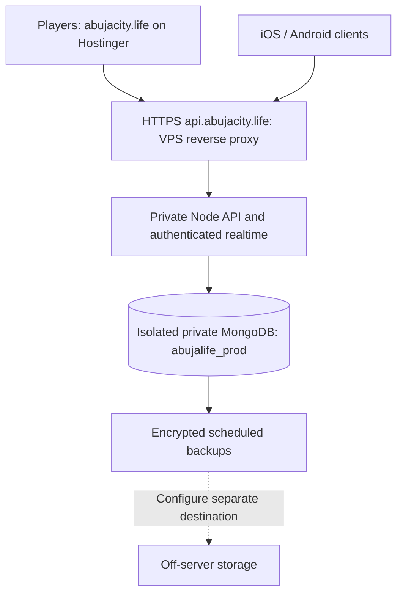

# AbujaLife production deployment

Deploy the genuine static frontend on **Hostinger shared hosting at `https://abujacity.life`**. Run the separate **Node 24 API at `https://api.abujacity.life`** on the VPS with its own authenticated MongoDB replica set and database **`abujalife_prod`**. Production starts only with working MongoDB, schema/index readiness and transaction support; it has no SQLite or local-preview fallback.

This document supersedes the earlier single-origin SQLite hosting plan. The legacy account-free browser preview remains a separate, explicitly local-save artifact; do not upload its ZIP as the production frontend.

## Access and current status

The authorized read-only SSH target is `Administrator@173.212.249.202`, port 22. The coding environment has no `~/.ssh/id_ed25519` key. Its global SSH configuration initially had invalid permissions; a single corrected `ssh -F /dev/null` BatchMode attempt returned **connection refused**, exit 255. No remote authentication, inspection or modifications occurred. No Okrika checkout exists at the workspace top level, and remote Okrika services, database names, ports, volumes and proxy configuration could not be inspected.

Hostinger hPanel must be opened in the owner's own browser. There is no authenticated Hostinger connector or browser-control tool here. Official Hostinger help pages returned proxy CONNECT 403. These facts block live deployment and public-domain acceptance; a completed source package does not prove public hosting, DNS or certificate issuance. Do not put passwords, private SSH keys or payment secrets into chat or Git.

Local infrastructure acceptance on 4 October 2026 passed: **36 authenticated Mongo integration tests and 12 production HTTP tests**, plus actual Docker API startup as UID 1000, selection of recorded immutable images, encrypted consistent backup, corrupted-archive rejection before writes, complete snapshot restore that removes collections created after the backup, and successful API restart with account, session, wallet and administrator state preserved. Isolated deployment recovery checks also verified that a stopped prior API still requires a backup, failed backups prevent startup/migrations, and a Compose startup failure attempts the prior image without recording success. These checks used disposable local infrastructure, not the live VPS or public domains. CI execution and public DNS, certificates and Hostinger behaviour remain unverified.

Before remote deployment, establish a reachable authenticated SSH session using the owner's authorized key and inspect the existing services and reverse proxy read-only. Confirm the operating system, Docker/Compose versions, free loopback port, storage, authoritative DNS and how Okrika is currently exposed. Use dedicated AbujaLife directories, Docker project, networks, volumes, users and database. None of these scripts changes an Okrika repository, database, DNS name or proxy automatically.

## Topology and ownership



| Component | Location | Public surface |
| --- | --- | --- |
| Production frontend | Hostinger domain document root | `abujacity.life`, static files only |
| Production API | Dedicated VPS Docker service `api` | `api.abujacity.life`, through the existing HTTPS reverse proxy |
| MongoDB 8 | Dedicated private Docker network and volumes | No published database port |
| Mongo bootstrap | Short-lived privileged ops container | No public port |
| Backup/restore | Explicit short-lived ops containers | No public port; encrypted protected host files |

The API listens on container port 3000 and binds only to host loopback port 18787 by default. Check that port on the actual VPS before using it. MongoDB uses the single-member replica set `abujalife`, which enables transactions but provides **no redundant failover**. The current API/SSE deployment is a single process; this configuration does not certify millions of concurrent players or horizontal fanout.

The default Compose project is `abujalife-prod`. Mongo volumes and application data belong exclusively to this project. The API filesystem is read-only; its Node process drops to UID/GID 1000 after reading mounted secrets. Containers restart automatically and Docker rotates JSON logs at 10 MB across five files. Do not point the API at any shared Okrika database or mount its files.

## Build, validate and package

Use the repository's production infrastructure branch and Node 24 or later:

```bash
npm ci --ignore-scripts
npm run build
npm run qa
npm run qa:infra
```

`qa:infra` runs `node deploy/test-production.mjs`. Docker must be available. It creates a random **disposable** Compose project and secrets outside the checkout, boots real authenticated MongoDB, applies the privileged schema/roles, runs all actual Mongo integration tests and production HTTP tests, starts the actual API image as UID 1000, and checks a consistent encrypted backup, corruption rejection, restore and account/session/wallet/admin persistence. It removes only its own fixture containers, volumes, images, relay and temporary credentials, preserving the failure exit status. It never accepts an existing production URI.

In this cloud environment the Docker build needed the configured network proxy's DNS mapping and its supplied trusted CA certificate. The test runner passes them as standard Docker build proxy arguments and an ephemeral BuildKit CA secret. TLS certificate checks remain enabled. Normal VPS builds need ordinary verified HTTPS access to the package registry and image registries; no rendering API or account token is needed.

Allow enough local Docker disk space. This cloud's VFS storage driver duplicates image layers, so accumulated unused build cache exhausted the filesystem during a rerun. Removing only unused build cache freed about 11 GB without touching the running shared Mongo service or its volumes; the complete subsequent infrastructure run passed. Do not prune application volumes or live containers to make space.

After checks pass and the exact source is committed, create distinct packages:

```bash
node deploy/package-release.mjs /tmp/abujalife-production-api.tar.gz
python deploy/package-frontend.py /tmp/abujacity-production-frontend.zip
```

The API archive includes every public deployment helper, Dockerfile and source file needed to build and operate the server. The frontend ZIP contains the genuine `dist/` output, public runtime configuration, install assets, `/admin/` shell and `.htaccess`; it contains no server sources or credentials. Both include file-level SHA-256 metadata and adjacent whole-archive checksums. Secrets, `.env`, databases, backups, local progress and Git history are excluded. Verify checksums and the recorded revision before uploading. `RELEASE.json` marks uncommitted source explicitly; the deployment helper refuses such a release by default.

## Initialize the dedicated VPS stack

These steps require a Linux VPS with Docker Engine, Docker Compose and Node 24 available to the operator. They have not been executed on the inaccessible live VPS. Extract a verified API archive into an immutable release directory, such as `/opt/abujalife/releases/RELEASE_ID`, and keep private configuration outside that code directory:

```bash
node deploy/init-env.mjs /opt/abujalife/shared
export ABUJALIFE_DEPLOY_ENV_FILE=/opt/abujalife/shared/.env
node deploy/verify-release.mjs
node deploy/deploy.mjs
```

The initializer creates private 0600 files under a 0700 `.secrets` directory and preserves every existing secret. It generates the Mongo root, application and backup passwords, replica-set keyfile, application URI, stable payment encryption key and separate backup encryption key. It prints filenames only. The generated `.env` contains host controls and protected directory paths, not passwords. Choose an unused `ABUJALIFE_API_LOOPBACK_PORT` there after inspecting the VPS.

The bootstrap identity initializes the replica set, validators and unique/TTL indexes, then creates the dedicated `abujalife_app` user. Its custom role grants normal row operations only on explicit `abujalife_prod` collections. **Ledger and wallet-transfer records permit find/insert plus metadata-only listIndexes; update, delete and DDL are denied.** The application cannot read Okrika or another database. The backup identity can read only this database and briefly lock/unlock this isolated instance for a consistent snapshot; it has no application role-management authority. Root credentials are used only for initialization or an explicit restore.

`deploy.mjs` verifies release hashes, checks configuration, builds immutable image tags, takes a pre-update encrypted backup, applies the bootstrap/migrations and starts only this stack. It checks actual Mongo API readiness before recording success. If the new API fails and a prior release record exists, it attempts the prior immutable API image; it does **not** reverse database migrations or silently restore older player data. First-deployment failure stops the API and records no successful release. Keep the previous release and backups until public acceptance passes. Avoid `docker compose down -v`; that deletes the game's volumes.

For later operational commands, use `node deploy/compose.mjs` from the deployed code directory with `ABUJALIFE_DEPLOY_ENV_FILE` still pointing to the shared configuration. It selects the dedicated Compose project and the exact successfully deployed image tags and port from the protected release record. Backup and restore wrappers use that record too; they do not assume a mutable `:local` image exists.

## HTTPS API and DNS without replacing Okrika

Point the **API subdomain A record** `api.abujacity.life` to the verified VPS IPv4 address. Add an AAAA record only if the VPS actually has working IPv6. Keep the root `abujacity.life` attached to Hostinger's frontend and preserve its unrelated email/DNS records. Make changes at the authoritative DNS provider, which may differ from the domain seller.

The normal deployment does not start a new port-80/443 proxy. After inspecting and backing up the live Okrika proxy, integrate only the AbujaLife API virtual host. `deploy/caddy-api.snippet` proxies the new API hostname to checked loopback port 18787 with immediate SSE flushing. Adjust that port if configured differently. Validate the existing proxy's complete configuration and reload it using its established procedure; do not replace its full configuration.

The optional Compose profile `standalone-edge` runs a dedicated Caddy service for an otherwise free server. Use it only after proving ports 80/443 are unoccupied and this will not disturb Okrika. Its `deploy/Caddyfile` serves **only `api.abujacity.life`** and obtains/renews certificates when DNS and inbound ports permit. Do not start this profile on top of an existing proxy. Caddy preserves the public host, signals HTTPS for Secure cookies and flushes SSE. `TRUST_PROXY=1` relies on the API remaining private behind that controlled proxy.

## Upload the production frontend to Hostinger

Log in to [Hostinger hPanel](https://hpanel.hostinger.com/) in your own browser. Select the website attached to `abujacity.life`, preserve any existing site, and upload/extract **`abujacity-production-frontend.zip` into that domain's actual document root**. Confirm the directory in hPanel instead of assuming which website owns a `public_html` folder. The ZIP has files at its root, so it must not add an extra path segment.

Enable the frontend's managed HTTPS certificate and HTTPS redirect. `runtime-config.js` exposes only `PUBLIC_WEB_URL` and `API_PUBLIC_URL`. All account, economy, social, admin and payment requests go to the real API with credentialed CORS; the exact frontend origin is allowlisted. Runtime config, HTML, service worker and the admin shell are not cached; fingerprinted public chunks can be cached long term. The service worker caches public app assets only, never private API responses, messages or money state. `/api` on the frontend returns 404 instead of pretending to be a backend.

Account creation currently needs no email verification. Signup and login are real persistent Mongo accounts. Password reset delivery needs a future configured mail-provider adapter and is unavailable while none is configured. A user-facing Home Screen helper observes browser support and a reminder cooldown; iPhone Safari uses Share → Add to Home Screen. The site cannot force an operating-system install dialog. Installed mode stops reminders.

## Administrator and optional Flutterwave

Register the intended owner through the actual production frontend first. Grant that **existing** resident from the private server console:

```bash
node deploy/compose.mjs exec api node deploy/admin-bootstrap.mjs --username YOUR_EXISTING_USERNAME
```

The helper uses Mongo transactions and writes an audit entry. It never creates an account or lets a future matching username inherit power. Then open `https://abujacity.life/admin/` as that resident. The public shell contains no privileged state; API roles and permissions authorize each operation.

Enter Flutterwave credentials in the dashboard. The stable private `ABUJALIFE_CONFIG_KEY` protects stored credentials and pending-order verification secrets; do not rotate or lose it across releases/restores. Start with provider **test** mode and verify a real provider test transaction before live checkout. An independently verified exact provider reference, transaction ID, successful status, NGN amount, currency and resident ownership are required before one atomic credit. The frontend never supplies authoritative balances or successful-payment claims. No live merchant or live payment was configured during development.

## Consistent encrypted backups and restores

Run from a compatible release using the same private deployment environment:

```bash
export ABUJALIFE_DEPLOY_ENV_FILE=/opt/abujalife/shared/.env
node deploy/backup-run.mjs
```

The dedicated backup identity briefly blocks writes on **this isolated Mongo instance**, dumps only `abujalife_prod`, releases the lock, then encrypts the archive with authenticated **AES-256-GCM**. This yields a consistent multi-collection snapshot without dumping another database. Large archives take longer; schedule accordingly and confirm write-lock release if a backup process is abruptly killed. The API may queue writes during that brief lock.

`BACKUP_RETENTION_DAYS` controls local retention. Optional `BACKUP_OFFSERVER_TARGET=user@host:/absolute/path` and `BACKUP_OFFSERVER_KEY_FILE=/private/key/path` enable actual SCP upload to a separate machine with strict known-host checking. Preconfigure its trusted host key and permissions. A failed configured upload fails the run and prevents retention deletion. The receipt reports **not-configured** when no separate host exists; local backups do not count as off-server protection. Remote retention is the separate host's policy. Keep the encryption key and deployment secrets safely outside both the Git checkout and backup archive.

The optional backup service/timer templates schedule 03:15 Abuja time daily, with a short random delay. Review the absolute release path and `/usr/bin/node`, test one backup and restore, configure separate storage, then install/enable these operator-owned units. They are not installed automatically.

To restore, stop only the AbujaLife API, then explicitly confirm the database:

```bash
node deploy/compose.mjs stop api
node deploy/restore-run.mjs SELECTED_FILE.abjl.enc --confirm abujalife_prod
```

Restore authenticates the complete encrypted archive and runs the database tool's archive metadata preflight **before any database modification**, restricts namespaces to `abujalife_prod.*`, and requires a stopped API through the host wrapper. The tool's dry run checks metadata rather than every document; use an authenticated archive produced by a successful backup from this stack. Restore then drops only the exact isolated `abujalife_prod` database and restores the selected snapshot, so newer collections cannot survive an older backup and leave inconsistent money or social state. This deliberately replaces current game data. A failed restore remains offline until a compatible snapshot is restored successfully. Restore the matching private keys/passwords if rebuilding a lost VPS, run privileged schema bootstrap for the known-compatible release, restart API and check accounts, sessions, balances, homes, purchases, messages and administrator roles. Database restore is explicit; a failed software deployment does not automatically discard newer player progress.

## Public launch acceptance

After live hosting is configured, run normal verified HTTPS checks:

```bash
node deploy/health-check.mjs https://api.abujacity.life
```

Confirm the frontend root and `/admin/`, manifest, icons, runtime config and real service-worker activation. In two actual browser sessions, register distinct residents, finish appearance setup, refresh/reopen, exchange a real message and one reviewed game-Naira transfer, and verify updates on both devices. Check a room change, consented visit, logout/re-login and backend restart. Check a provider test payment only after credentials are configured. Preserve the existing Okrika application throughout. Public DNS, TLS, actual Hostinger headers/proxy behaviour, physical-device installation, off-server delivery and live merchant operation remain unverified until performed on the real deployment.
